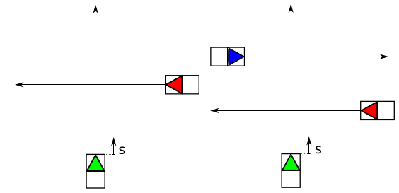

# Longitudinal trajectory planning with a continuous method

In this project I show how to implement a trajectory planner that solves problems such as the two depicted below.

In both scenarios the green car represents a self driving car. Its path is predefined, however its velocity decomposition is yet to be computed. In the [Math-Basics-Notebook](https://github.com/MarcosSobrinho/trajectory_planning/blob/master/math_basics.ipynb) I explain the mathematical background. It is a simplification of the method introduced in the [Trajectory Planning for BERTHA - a Local, Continuous Method](https://pdfs.semanticscholar.org/bdca/7fe83f8444bb4e75402a417053519758d36b.pdf) - paper. The paper is about a 2D trajectory planning, inlcuding longitudinal and lateral control. 

